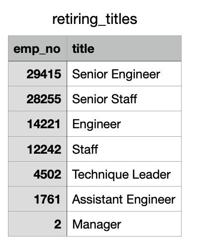
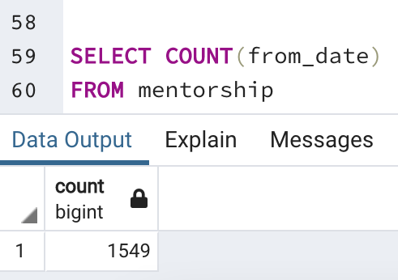
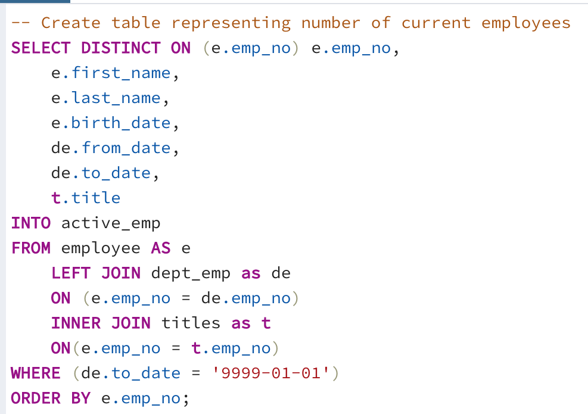

# Pewlett-Hackard-Analysis

## Overview of Project

### Purpose
The goal with this project is to prepare Pewlett-Hackard with projections regarding their retirement and mentorship programs. In the first deliverable, I used SQL to determine the number of retiring employees per job title. Then, I used the same language to identify all of the employees elibigle to participate in a mentorship program. 

## Results

### Deliverable 1: Eligible Retirees
- The unique_titles table shows all active employees that are nearing the age of retirement only showing their current title, so every employee is only in this table once.

- Most of the retiring roles are that in senior level positions. 29,414 Senior Engineers and 28,254 Senior Staff are retiring, this means that Pewlett-Hackard needs to consider a hiring strategy that will not feel unnatural to junior and entry level employees. 

- Many engineers are retiring. 29,414 Senior Engineers, 14,222 Engineers, and 1,761 Assistant Engineers are retiring this year. This brings the total retiring engineer count to 45,397. Refer to an image of the count of retiring job titles below: 
 

   

### Deliverable 2: Mentorship Program

- The mentorship_eligibility table contains a list of employees who are eligible for the mentorship program based on their age. We were looking for employees born in the year 1965.

- There are 1,549 eligible mentorship employees born in 1965. This is significantly lower than the total number of retiring employees. See the count of mentorship eligible employees below:

   

## Summary 
 How many roles will need to be filled as the "silver tsunami" begins to make an impact?
The queries that built unique_titles table shows that 90,398 employees at Pewlett Hackard will reach retirement age in the next 5 years. As mentioned above, most of the retiring roles are that in senior level positions. 29,414 Senior Engineers and 28,254 Senior Staff are retiring. Additionally, many engineers are retiring. 29,414 Senior Engineers, 14,222 Engineers, and 1,761 Assistant Engineers are retiring this year. This brings the total retiring engineer count to 45,397. 

I built a table to calculate the total number of current active employees to find the percentage of total employees that are retiring in the next five years: 

   

I found the total number of employees to be 240,124. Meaning that 37.6% of Pewlett-Hackard employees are retiring!

### Are there enough qualified, retirement-ready employees in the departments to mentor the next generation of Pewlett Hackard employees?

Based on the table we built in Deliverable #2, mentorship, there are 1,549 employees eligible to mentor at Pewlett-Hackard. I found this by using the COUNT function on the number of from_date entries in the mentorship table. See the image below!

   

There are over 90,000 employees retiring in the next five years, meaning an average of 18,000 employees exiting the company each year. Having just over 1,500 employees eligible to mentor for one year is not nearly enought!
